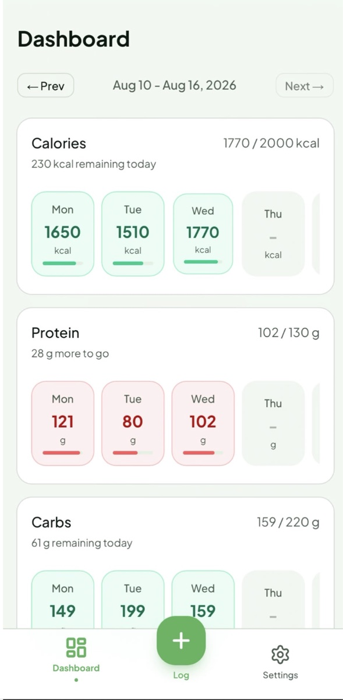
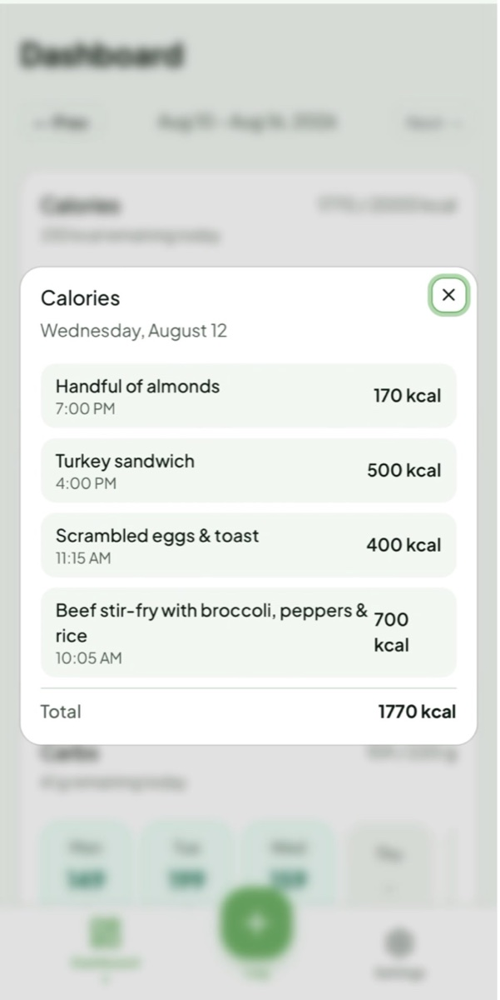
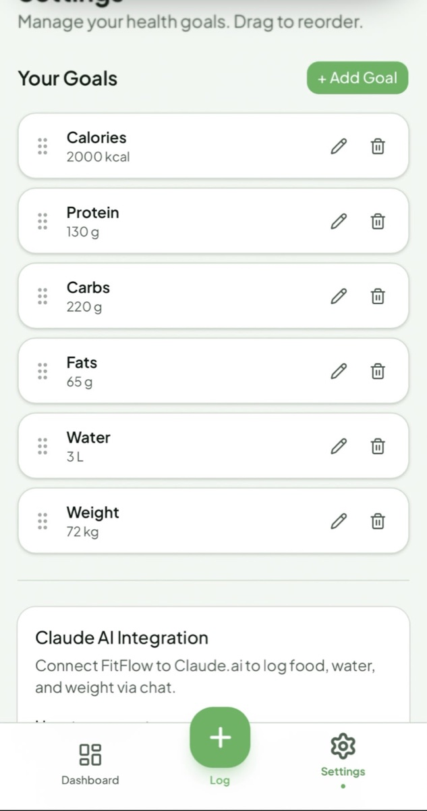
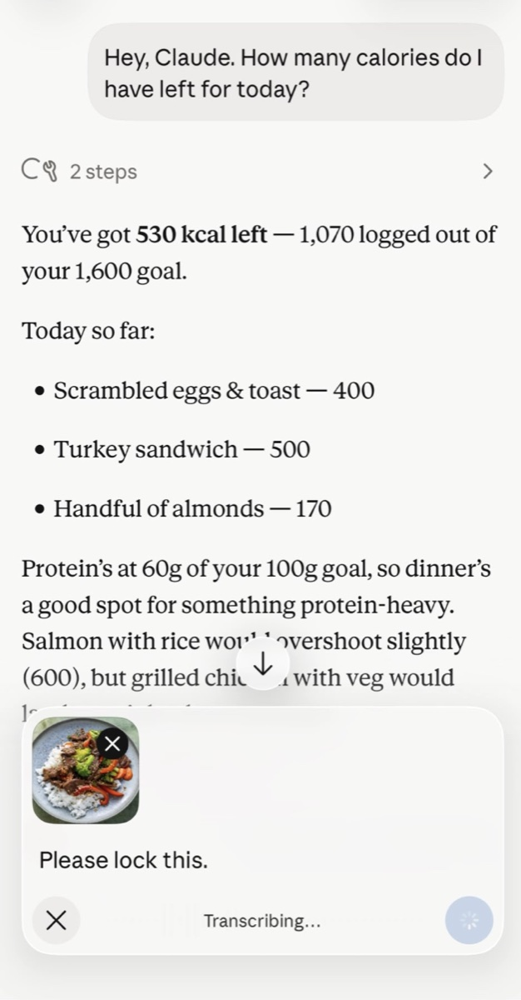
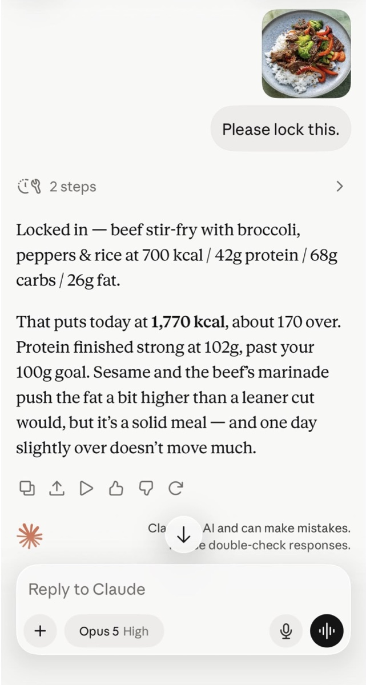

# FitFlow

A personal **nutrition & health tracker** with a twist: you can drive it from
**Claude**. Define your own goals (calories, protein, water, weight, …), log meals
in a tap, and watch your progress on a dashboard — or just tell Claude *"log a
chicken salad for lunch"* and *"how's my protein this week?"* and it does the rest
through a built-in **MCP server**.

## Live demo

Try it without installing anything:

**→ [Open the live demo](https://fitflow.thatsmy.app)**

- **Email:** `demo@fitflow.thatsmy.app`
- **Password:** `fitflowdemo2026`

The demo account is preloaded with ~2 weeks of goals and food logs, so the dashboard
and history are populated. It's a shared sandbox — feel free to add or edit entries;
the data may be reset periodically.

## Screenshots

**The app**

<table>
  <tr>
    <td align="center"><b>Dashboard</b></td>
    <td align="center"><b>Day log</b></td>
    <td align="center"><b>Goals</b></td>
  </tr>
  <tr>
    <td></td>
    <td></td>
    <td></td>
  </tr>
  <tr>
    <td align="center">Per-goal progress across the week.</td>
    <td align="center">Everything logged for a day, with totals.</td>
    <td align="center">Custom goals — calories, protein, water, weight…</td>
  </tr>
</table>

**Drive it from Claude** (via the built-in MCP connector)

<table>
  <tr>
    <td align="center"><b>Ask about your day</b></td>
    <td align="center"><b>Log a meal from a photo</b></td>
  </tr>
  <tr>
    <td></td>
    <td></td>
  </tr>
  <tr>
    <td align="center">"How many calories do I have left today?"</td>
    <td align="center">Send a photo — Claude logs it through the MCP endpoint.</td>
  </tr>
</table>

## What it does

- **Custom goals** — create any goal with a type (`food` / `water` / `weight`), a
  target, a unit, and a direction (hit *at least* or *at most* the target). Reorder
  them by drag-and-drop.
- **Fast logging** — log food entries with per-goal values (e.g. one meal → calories,
  protein, carbs, fats), plus one-tap water and weight logging.
- **Daily view & smart suggestions** — see everything logged for a day; get
  time-of-day suggestions from what you usually eat around now.
- **Dashboard** — per-goal progress aggregated over any date range.
- **Use it from Claude** — connect the app as a Claude **connector** and use natural
  language to list goals, log entries, edit logs, and read your dashboard. Six tools
  are exposed over an OAuth-protected MCP endpoint.

## Highlights for the curious

- **Next.js 16** App Router with React Server Components; a thin, dependency-free API
  layer under `src/app/api`.
- **Prisma 7 + Prisma Postgres** using the new **driver-adapter** client (no Rust
  engine). Every query is scoped to the authenticated user — the app is the trust
  boundary.
- **better-auth** for email/password auth, sessions, and password reset (emails via
  Resend, with a dev fallback that logs the reset link).
- **OAuth2 / OIDC provider built in** (better-auth's MCP plugin): dynamic client
  registration + PKCE + a consent screen, so Claude's connector can authorize against
  your own server. `/api/mcp` validates the access token and runs the tools on Prisma.
- Deploys as a **Next.js standalone** bundle (e.g. to Prisma Compute or Vercel).

## Tech stack

| | |
|---|---|
| Framework | [Next.js](https://nextjs.org) 16 (App Router, RSC) · React 19 · TypeScript |
| Database | [Prisma](https://www.prisma.io) 7 + PostgreSQL (`@prisma/adapter-pg`) |
| Auth | [better-auth](https://www.better-auth.com) — sessions, password reset, OAuth/OIDC + MCP |
| UI | [Tailwind CSS](https://tailwindcss.com) v4 · shadcn/ui · dnd-kit · SWR |
| Email | [Resend](https://resend.com) (password-reset links) |
| Protocol | [Model Context Protocol](https://modelcontextprotocol.io) (`@modelcontextprotocol/sdk`) |

## Getting started

**Prerequisites:** Node.js 20+ and a PostgreSQL database (a [Prisma
Postgres](https://www.prisma.io/postgres) database works out of the box).

```bash
git clone https://github.com/sharifshayma/Fitflow.git
cd Fitflow
npm install
cp .env.example .env      # then fill in the values (see below)
npm run db:migrate        # apply the schema to your database
npm run dev               # http://localhost:3000
```

### Environment

| Variable | What it's for |
|---|---|
| `DATABASE_URL` | PostgreSQL connection string |
| `BETTER_AUTH_SECRET` | Auth secret — generate with `openssl rand -base64 32` |
| `BETTER_AUTH_URL` | The app's base URL (e.g. `http://localhost:3000`) |
| `RESEND_API_KEY` | Optional — send real reset emails (otherwise the link is logged) |
| `RESEND_FROM` | Verified sender address for reset emails |

## Connecting Claude

1. Deploy the app (or expose it publicly) and note its URL.
2. In Claude → **Settings → Connectors → Add custom connector**, use your app's MCP
   endpoint — `https://<your-app>/api/mcp` (the live demo is
   `https://fitflow.thatsmy.app/api/mcp`).
3. Claude registers itself, you sign in and approve the consent screen, and the six
   tools (`list_goals`, `save_goal`, `delete_goal`, `log_entry`, `get_logs`,
   `edit_log`) become available in chat.

## Project layout

```
src/
  app/
    api/            # goals, food-logs, dashboard, auth, mcp, oauth discovery
    (pages)         # login, reset-password, consent, dashboard, log, settings
  lib/
    prisma.ts       # Prisma client (driver adapter)
    auth.ts         # better-auth config (+ MCP/OIDC plugin)
    session.ts      # getUserId() from the session
    serializers.ts  # Prisma rows → API JSON shapes
prisma/schema.prisma
```

## License

MIT
